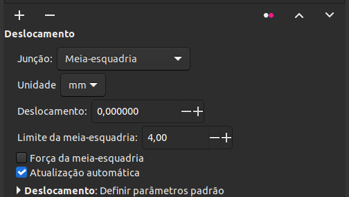

# 🟡 Gradiente


Atalho: \[ G ]


 (1) (1) (1) (1).png>)

A ferramenta gradiente permite criar gradientes lineares ou radiais par preenchimento ou contorno. Para criar um degradê, apenas selecione um ou mais objetos e selecione a ferramenta, daí clique para criar uma linha e ver em tempo real a posição do degradê. Para modificar essa distribuição do degradê, basta arrastar as alças visíveis sobre o objeto em questão.

 (1).png>)

&#x20;Os dois primeiros modificadores da barra de controle alteram entre gradiente linear e radial, os dois seguintes alternam entre preenchimento e contorno. Você pode aplicar gradientes diferentes para preenchimento e contorno, como na imagem abaixo. Criamos um gradiente linear para preenchimento e um gradiente radial para contorno.

 (1) (1) (1).png>)

A seguir, em _seleção_ podemos escolher numa lista entre os gradientes já presentes no nosso arquivo. O cadeado à direita permite vincular modificações feitas no gradiente (exemplo abaixo). Se desativado, modificações criarão um novo gradiente.

Em seguida temos o botão _inverter_ que pode ser aplicado para todo gradiente ou apenas para o preenchimento ou contorno, se selecionados.


Nos nossos testes, não conseguimos inverter apenas o gradiente de contorno, isso pode ser um bug ou apenas uma limitação da ferramenta.


O campo _repetir_ altera como o gradiente é "estendido". Na opção _nenhum,_ o gradiente irá estender suas últimas cores por todo objeto em um degradê suave. Na opção _refletido_, o gradiente se repete no mesmo padrão (a distância da linha traçada) de forma refletida, o que lhe dá uma transição suave.  Em _direto_ o gradiente é repetido na mesma direção.

 (1) (1).png>)

Por último, temos a edição dos pontos do degradê. Todo degradê tem ao menos dois pontos e você poderá acrescentar quantos pontos intermediários quiser. O primeiro campo, _pontos_, exibe uma lista dos pontos, o que é basicamente a cor sólida de cada ponto. Clicando sobre um ponto você o estará selecionando e poderá alterar sua cor e deslocamento. _Deslocamento_ serve para fazer isso manualmente, você poderá definir um valor numérico para o distanciamento. Os dois últimos botões permitem acrescentar novos pontos ou excluir um ponto selecionado.

Para criar um ponto diretamente sobre o desenho do degradê, basta clicar duas vezes sobre a linha do degradê e alí será criado um novo ponto. Você também poderá excluir um ponto clicando sobre ele e apertando a tecla \[ delete ] ou clicar sobre ele se selecionar uma nova cor.

Você também poderá editar gradientes diretamente no painel de [Preenchimento e contorno](../paineis/preenchimento-e-contorno.md) que sintetiza todas as funções que apresentamos anteriormente com uma extra funcionalidade que é alternar a transparência de cada ponto individualmente.&#x20;


Você também pode selecionar cores com a ferramenta conta-gotas, selecionando o ponto de deseja modificar e usando o atalho \[ D ] para usar o conta-gotas.


Existem ainda outras formas de gradiente que não são possíveis de serem feitas diretamente e exclusivamente com a própria ferramenta. Para explorá-las, confira o capítulo [Técnicas de Gradiente](../tecnicas/tecnicas-de-gradiente.md).
