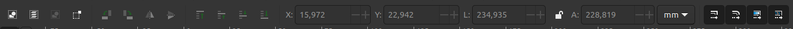
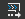
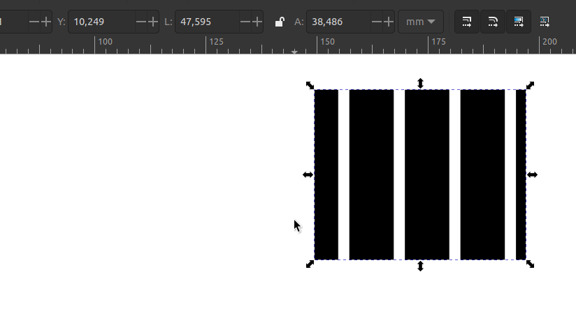

# 🟡 Seletor


Atalho: \[ F1 ]


A ferramenta seletor permite várias operações de seleção e transformação dos objetos. Assim como a ferramenta [Zoom](zoom.md), seus atalhos são importantes para acelerar seu uso do programa. Ao ser ativada, basta clicar em qualquer objeto para selecioná-lo, movê-lo ou usar as alças para transformarão.

Seguindo a ordem da barra de controle nós temos,  (1).png>) **\[Crtl + A]** seleciona todos os objetos apenas na [camada](../paineis/camadas-e-objetos.md) atual.  (1).png>) **\[Crtl + Shift + A]** Permite selecionar todos os objetos de todas as camadas [visíveis e não bloqueadas](../paineis/camadas-e-objetos.md#visivel-e-bloqueado).  (1).png>)**\[Esc]** irá desfazer a seleção atual. Também é possível inverter a seleção atual com o atalho **\[!].**  Ainda é possível usar o atalho **\[Alt + Click]** para selecionar sucessivamente o objeto abaixo ou **\[Alt + girar a roda do mouse]** para navegar entre os objetos abaixo do ponteiro do mouse.

 (1) (1).png>) Muda o comportamento da caixa de seleção. Por padrão, apenas os objetos inteiramente dentro da seleção serão ativados, ao alternar este modificador qualquer objeto perpassado pela caixa de seleção será ativado.

Os botões seguintes  (1) (1).png>) permitem girar em 90º para a esquerda e direita; inverter verticalmente e horizontalmente.&#x20;

A seguir temos os botões de posição  (1).png>). Na ordem, trazer o objeto selecionado para frente de todos os objetos; elevar a oposição do objeto em um nível; reduzir a posição do objeto em um nivel; trazer o objeto para trás.


Note que ao elevar ou reduzir um nível para uma seleção de vários objetos, cada um será reposicionado segundo sua posição anterior. A confiná-los em um grupo, eles então estarão na mesma posição relativa aos outros objetos.


 (1).png>)

As opções seguintes (imagem acima) permitem alterar a posição do objeto no canvas, determinado pelos campos X e Y. Os campos L e A determinam Largura e altura do objeto. O cadeado no centro permite alterar as dimensões proporcionalmente. A última caixa permite alterar a unidade de medida.

Seguindo, temos o modificador  (1) (1).png>) altera como o contorno é redimensionado junto com o objeto. Se desativado, o contorno permanecerá no seu tamanho original.

 (1) (1).png>) Altera como o raio do [retângulo](retangulo.md) será redimensionado. Se desativado, o retângulo terá um raio fixo.&#x20;

O penúltimo modificador altera a posição dos gradientes relativo à posição do objeto. Se desativado, o gradiante permanecerá onde foi criado. Essa opção pode ser útil em composições em que múltiplos objetos compartilham do mesmo gradiente original.

O modificador para _mover padrões_  irá alternar entre redimensionar preenchimentos para o novo tamanho do objeto ou manter o tamanho do padrão enquanto o distribui no novo tamanho.

Vamos agora entrar fundo para as interações da ferramentas diretamente no canvas. Ao clicar sobre um objeto, aparecerão as alças para mudar as suas dimensões, um clique-duplo irá mudar as alçar para girar ou inclinar o objeto.

 (1).png>) (1).png>)

As teclas **\[Crtl]** e **\[Shift]** modificam a interação com as alças. No caso das alças de dimensão, pressionar **\[Crtl]** mantêm a proporção do objeto e **\[Shift]** faz com que o objeto permaneça no seu centro. É possível pressionar as duas teclas ao mesmo tempo para um efeito simultâneo. Para as alças de giro e inclinação, **\[Shift]** irá fazer com que o objeto gire ou incline em num eixo oposto ao ponto da alça selecionada. **\[Crtl]** fará com que o objeto gire em incrementos de 15º por padrão.

A alça com formato de alvo determina qual é o centro de transformação do objeto.&#x20;

### Manipulação de objetos 

Existem vários outros atalhos ou interações que não estão explícitas na barra de controle da ferramenta. Vamos citar algumas:&#x20;

* Ao mover objetos, eles poderão ser atraídos por outros elementos. Modifique as [opções de atração](../configuracoes-de-atracao.md) para ajustar às suas preferências.&#x20;
* Objetos ou camadas [bloqueadas](../paineis/camadas-e-objetos.md#visivel-e-bloqueado) não podem ser selecionados.

### Atalhos:

| Atalho                     | Função                                             |
| -------------------------- | -------------------------------------------------- |
| Shift + Click              | Adiciona objetos à seleção.                        |
| Delete :arrow\_up:         | Exclui um objeto selecionado                       |
| Esc :arrow\_up:            | Retira a seleção ou retrocede na ferramenta        |
| Ctrl + A :arrow\_up:       | Seleciona tudo disponível na camada atual          |
| Ctrl + Alt + A :arrow\_up: | Seleciona tudo disponível em todas as camadas      |
| Crtl + D :arrow\_up:       | Cria uma cópia do objeto                           |
| Alt + D                    | Cria um clone do objeto                            |
| Alt + Click                | Seleciona sucessivamente o objeto abaixo           |
| Alt + Roda do mouse        | Seleciona sucessivamente o objeto acima ou abaixo  |
| Crtl + arrastar objeto     | Atrai o objeto para ser movido no seu eixo x ou y  |
| Setas do teclado           | Move o objeto                                      |
| Shift + Setas do teclado   | Move o objeto em incrementos                       |
| V :arrow\_up:              | Vira o objeto verticalmente                        |
| H :arrow\_up:              | Vira o objeto horizontalmente                      |
| Ctrl + ] :arrow\_up:       | Gira o objeto 90º em sentido horário               |
| Ctrl + \[ :arrow\_up:      | Gira o objeto em 90º em sentido anti-horário       |
| Ctrl + arrastar alças      | Mantêm proporção e gira em incrementos             |
| Shift + arrastar alças     | Mantêm objeto no centro e muda o eixo do giro      |
| Ctrl + C :arrow\_up:       | Copia um objeto                                    |
| Ctrl + V :arrow\_up:       | Cola um objeto sob o mouse                         |
| Ctrl + Alt + V :arrow\_up: | Cola um objeto no seu lugar original               |
| Shift + Ctrl + V           | Cola um estilo de um objeto copiado                |
| Ctrl + X :arrow\_up:       | Recorta um objeto                                  |
|                            |                                                    |

