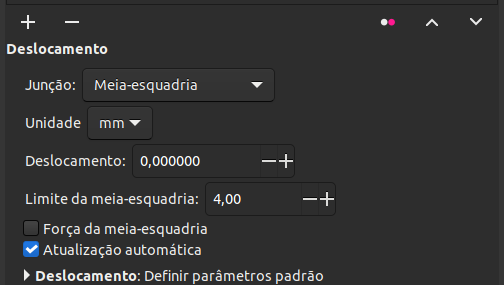

# Deslocamento | Offset

.png>)

Este LPE tem a função de expandir ou contrair um caminho, basicamente como a  [Expansão/Compressão](../#expansao-compressao-dinamica) do menu Caminho, mas com mais opções de personalização, sendo o mais importante a forma como os cantos serão tratados.&#x20;

Exemplo:

